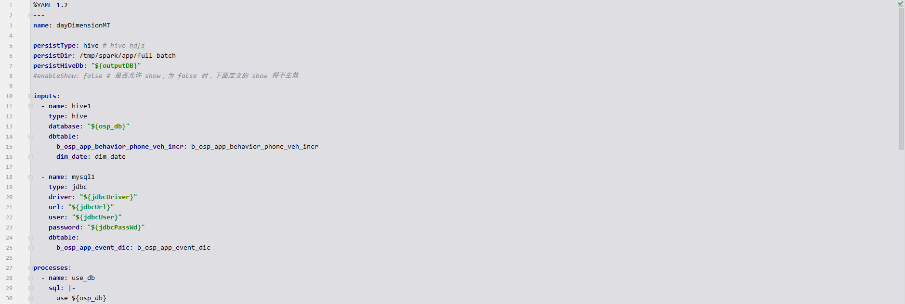
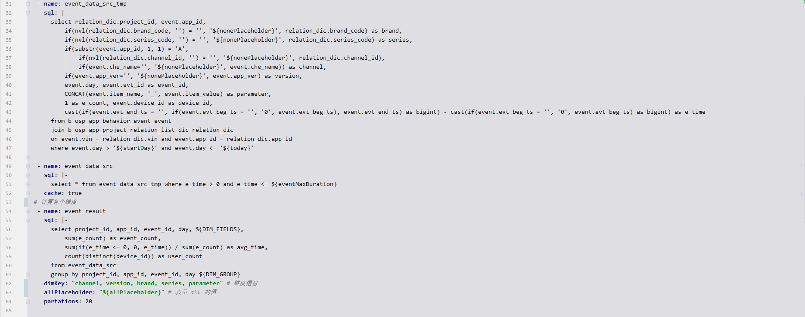
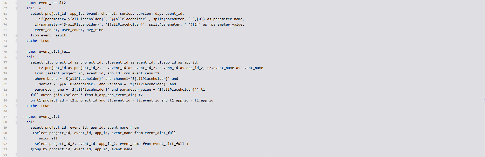
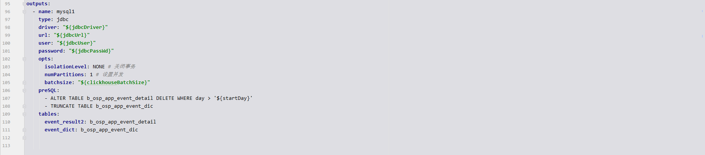

Light-Spark 开发脚架
==============================
[toc]
## 1. 概述

本人从 2014 年开始使用 Apache Spark，基于以往项目经验，为了降低项目开发复杂度，减少开发成本，开发了 light-spark 框架。
本框架屏蔽了底层技术细节，让开发人员面向 SQL 编程，更专注于业务逻辑，减少开发过程中 Debug 工作，让 Apache Spark 更方便使用。
  
## 2. 适用场景

项目业务大部分功能可以用 SQL 实现，符合以下情况，建议使用本框架：  

- 逻辑链条较长，开发周期较长
- 逻辑较复杂，开发时需要反复调试，从而反复修改 Debug 代码 
- 业务不稳定，功能频繁迭代
- 开发人员对大数据技术细节不太熟悉

## 3. 设计思想

- 大数据项目中整个处理流程如下：  
开始 -> 加载数据 -> 业务计算 -> 结果存储 -> 结束  

- 面向配置编程  
核心思想是面向 Spark DataFrame（SQL) 编程，通过 DataFrame 串联起数据处理流程各个环节，使用 SparkSQL 处理业务逻辑，并定义到配置文件，以便于开发和后期维护，业务调整时避免修改代码。
同时，暴露接口支持开发人员自定义硬编码，实现不能使用 SQL 处理的复杂逻辑，通过配置，把这些逻辑纳入整个处理流程。
- 使用样例
该样例背景为一个指标计算，需要加载 hive 表数据并关联 jdbc 中的表数据，经过 SQL 计算处理后，结果数据存储到 jdbc 表中，整个处理逻辑定义到一个配置文件中    





## 4. 使用
**启动脚本样例**
```shell script
#!/usr/bin/env bash
set -e
umask 0000

APP_HOME="$(cd $(dirname $0)/..; pwd -P)"
ROOT_PATH="$(cd $APP_HOME/..; pwd -P)"
currentTime=`date '+%Y-%m-%d_%H-%M-%S'`

if [ $# -eq 1 ];then
  params="-c qujia_prd.yaml -d $1"
elif [ $# -eq 2 ];then
  params="-c $2 -d $1"
# debug 
# params="-c $2 -d $1 --debug"
else
  echo "useage: $0 <date-yyyyMMdd> <conf>"
  exit 1
fi
STREAM_APP="com.hellowzk.light.spark.App" # 程序入口
echo "__________________________ light-spark start __________________________"

CLASSPATH="$APP_HOME/conf"

confList=`find $APP_HOME/conf/ -type f|sed ':a;N;s/\n/,/;ta;'` # 扫描目录下所有配置信息
APP_JAR="light-spark-assembly.jar" # 指定 jar 包名称
cmd="spark-submit"
cmd="$cmd --master yarn --deploy-mode cluster"
cmd="$cmd --files $confList"
cmd="$cmd --conf spark.app.name=light-spark-$1" # 指定 hadoop 应用名称
cmd="$cmd --conf spark.driver.extraClassPath=$CLASSPATH"
cmd="$cmd --conf spark.yarn.submit.waitAppCompletion=false"
cmd="$cmd --class $STREAM_APP $APP_HOME/lib/$APP_JAR $params"

echo "command to execute $0: $cmd" # > $APP_HOME/log/light-spark-$1.log
$cmd
```

### 4.2 组件

#### 4.2.1 debug 开发工具
开发过程中，可以通过配置，自动把指定步骤的结果持久化存储，支持 hdfs csv、hive 表

#### 4.2.2 input - 数据加载

1. 支持读取 hive 数据；
2. 支持读取 hdfs 数据，配置中定义好字段信息后自动加载成表；
3. 支持读取 classpath 数据，配置中定义好字段信息后自动加载成表；
4. 支持数据源类型比较复杂时，支持 自定义 处理源数据为表；
5. 支持读取 JDBC 的源数据，jdbcOpts 中参数请看 SparkSQL[官方文档][spark2.2.0]；

#### 4.2.3 process - 业务计算

1. 支持 SparkSQL 处理。
2. 处理逻辑较复杂，SQL 叫难实现时，支持硬编码实现业务需求。

#### 4.2.4 output - 结果保存

1. 存储到 HDFS ，格式可以选择为 txt / lzo 。
2. 存储到 HIVE 。
3. 存储到支持 JDBC 的数据库。 

#### 4.2.5 变量

##### 4.2.5.1 定义及使用
本框架支持在配置中自定义及使用变量，支持变量嵌套使用

- 灵活的定义位置  
  自定义变量可以在 yaml 配置中，也可以定义在 class 类中，定义的变量名称必须唯一。   
  定义在 class 中，例子 [MyConstants](example/src/main/scala/com/hellowzk/light/spark/MyConstants.scala)
  
- 变量使用  
  - 在 yaml 中使用，可以直接通过 ${variable} 使用预定义的变量
  - 在类中使用，如下
    ```
    import com.hellowzk.light.spark.constants.AppConstants
    AppConstants.variables("mysql_url")
    // 类型 variables: Map[String, String]
   ```
   所有可用变量存放在 AppConstants.variables 中
  
##### 4.2.5.2 日期表达式
支持通过日期表达式定义日期，表达式格式为
```shell script
DATE([yyyy-MM-dd, 20200722, yyyyMMdd][+3d][-1m][+1y]...)
```
- DATE() 为日期表达式声明符
- 第一个 [ ] 中， 有三个参数
  - 第一个为表达式最终计算结果格式
  - 第二个参数为基准时间，后续的日期计算是基于该时间的，可以省略，代表当前日期  
  - 第三个参数为第二个参数的时间格式，基于该格式解析第二个参数，第二个参数没有时，该参数同样不能定义
- 后面的 [ ] 中，代表时间计算表达式，大小写不敏感
  - ±nd 加/减 n 天
  - ±nm 加/减 n 月
  - ±ny 加/减 n 年
- 例子
```yaml
...
constansMap:
  today: "${DATE([yyyy-MM-dd])}" # 当前日期  
  today2: "${DATE([yyyy-MM, 2020-08-05, yyyy-MM-dd])}" # 2020-08-05 所在月份，2020-08
  date1: "${DATE([yyyy-MM-dd, 2020-08-05][-1d])}" # 2020-08-05 减一天，2020-08-04
  date2: "${DATE([yyyy-MM-dd, ${date1}][-1d])}" # 2020-08-04 减 1 天，2020-08-03
  date3: "${DATE([yyyy-MM-dd, ${date2}][-1d])}" # 2020-08-03 减 1 天，2020-08-02
  date4: "${DATE([yyyy-MM, ${date3}, yyyy-MM-dd][-1m])}" # 2020-08-02 减 1 月月份，2020-07
  date5: "${DATE([yyyy-MM-dd, ${date4}, yyyy-MM][-1d])}" # 2020-07 月初减 1 天， 2020-06-30
...
```

## 5. 配置文件

- 支持统一默认变量配置[default-config.yaml](example/src/main/resources/default-config.yaml)，优先级最低
- 完整样例请看 [full-batch.yaml](example/src/main/resources/full-batch.yaml)

### 5.1 整体结构

| 配置项 | 默认值|是否必填 | 说明 |
| :---- | :---- |:---- | :--- |
|name| |是|定义当前 yaml 文件流程名称|
|constansMap| |否，Map 类型|自定义常量，可以在当前 yaml 中通过 ${variable} 使用；在自定义代码中通过 AppConstants.variables("variable" 使用)|
|persistType| |否|使用 debug 组件，配置中间数据持久化的地址 hive/hdfs；开启条件，启动脚本中传入 --debug 参数启用 debug 组件|
|persistDir| |否|持久化到 hdfs 的位置，需要启用 debug 组件|
|persistHiveDb| |否|持久化到 hive 的库，需要启用 debug 组件|
|udaf| |否|自定义 UDAF，Map类型， key 为 udaf 命名，value 为值|
|inputs| |是|定义的输入数据|
|processes| |是|处理逻辑|
|outputs| |否|输出|
|envs| |否|环境参数，暂时只支持 Spark 相关参数|
```yaml
# 流程名称
name: "xxx" 

# 自定义常量，可以在sql/文件路径中使用 ${variable}，常量名称不可重复
constansMap: 
  hive_out_db: xxx
  mysql_url: xxx
  mysql_username: xxx
  mysql_passwd: xxx

# 启用 debug 工具，SQL处理时，如果 store=true ， 结果会缓存到 $baseDir/{{EVENT_DATE}}/$tableName 目录，启动脚本必须传入参数 --debug， 否则该配置不生效
persistType: hive # hive hdfs
persistDir: /tmp/spark/app/full-batch
persistHiveDb: "${outputDB}"

# 输入定义，支持 3 种数据源
inputs:
  - ...
    
# 逻辑处理，支持SQL 与 自定义处理， 有 3 种
processes:
  - ...

# 结果输出， 支持 3 种
outputs:
  - ...

# 环境设置
envs:
  # 暂时只支持 spark 相关参数，如下
  spark:
    - ...
```

### 5.2 数据加载
支持类型  

|type 值|说明 |
|:----|:----|
|classpathFile|加载 classpath 文件，通过配置字段、分隔符生成表|
|customClasspath| 加载 hdfs 文件，自定义加载逻辑，生成表|
|hdfsfile|加载 hdfs 文件，通过配置字段、分隔符生成表|
|customHdfs| 加载 hdfs 文件，自定义加载逻辑，生成表|
|hive| 加载 hive 表|
|jdbc| 加载 jdbc 表|
 
##### 5.2.1. 加载 classpathFile 数据
###### 配置说明  

| 配置项 | 默认值|是否必填 | 说明 |
| :---- | :---- |:---- | :--- |
| name| |是|定义该步生成的表的名称，可以在下面处理中引用|
| type| |是|固定值 classpathFile|
|columns| |是|数据生成的 columns， 用 "," 隔开|
|path| |是|文件在 classpath 的路径|
|fs| | 是| 列分割符|
|partations|0|否| 进行重新分区的数量，不配置不重分区|
|cache|false|否| 是否缓存，如果下面的操作多次使用该表，建议设置为true|
|show|0|否| 开发时 debug 使用，对表进行 show 操作，配置成需要 show 的条数|
|store|false|否| 开发时 debug 使用，数据存储起来，支持存储到 hdfs/hive，请配置 persistType 参数|
###### demo

```yaml
...
inputs:
  - name: person
    type: classpathFile
    columns: name, gen, age
    path: person.txt
    fs: ","
...
```

##### 5.2.2. 加载 customClasspath 数据

###### 配置说明  
自定义加载 classpath 的数据，生成表

| 配置项 | 默认值|是否必填 | 说明 |
| :---- | :---- |:---- | :--- |
| name| |是|定义该步生成的表的名称，可以在下面处理中引用|
| type| |是|固定值 customClasspath|
|path| |是|文件在 classpath 的路径|
|clazz| |是| 自定义的加载逻辑类，必须继承 com.hellowzk.light.spark.stages.custom.CustomBaseInput 实现 process 方法|
|partations|0|否| 进行重新分区的数量，不配置不重分区|
|cache|false|否| 是否缓存，如果下面的操作多次使用该表，建议设置为true|
|show|0|否| 开发时 debug 使用，对表进行 show 操作，配置成需要 show 的条数|
|store|false|否| 开发时 debug 使用，数据存储起来，支持存储到 hdfs/hive，请配置 persistType 参数|
###### demo

```yaml
...
inputs:
  - name: custompersonClass
    type: customClasspath
    path: person2.txt
    clazz: com.hellowzk.light.spark.stages.Process1
...
```

##### 5.2.3. 加载 hdfsfile 数据
###### 配置说明  

| 配置项 | 默认值|是否必填 | 说明 |
| :---- | :---- |:---- | :--- |
| name| |是|定义该步生成的表的名称，可以在下面处理中引用|
| type| |是|固定值 hdfsfile|
|columns| |是|数据生成的 columns， 用 "," 隔开|
|path| |是|文件在 hdfs 的路径|
|fs| | 是| 列分割符|
|partations|0|否| 进行重新分区的数量，不配置不重分区|
|cache|false|否| 是否缓存，如果下面的操作多次使用该表，建议设置为true|
|show|0|否| 开发时 debug 使用，对表进行 show 操作，配置成需要 show 的条数|
|store|false|否| 开发时 debug 使用，数据存储起来，支持存储到 hdfs/hive，请配置 persistType 参数|
###### demo

```yaml
...
inputs:
  - name: person_hdfs
    type: hdfsfile
    columns: name,gen,age
    path: /tmp/zhaokui/testdata/test/20200706/
    fs: ","
...
```

##### 5.2.4. 加载 customHdfs 数据
自定义加载 customHdfs 的数据，生成表
- 自定义加载逻辑类必须继承 com.hellowzk.light.spark.stages.custom.CustomBaseInput 特质，实现 process 方法，如 [Process1](example/src/main/scala/com/hellowzk/light/spark/stages/Process1.scala)

###### 配置说明  

| 配置项 | 默认值|是否必填 | 说明 |
| :---- | :---- |:---- | :--- |
| name| |是|定义该步生成的表的名称，可以在下面处理中引用|
| type| |是|固定值 customHdfs|
|path| |是|文件在 hdfs 的路径|
|clazz| |是| 自定义加载逻辑类|
|partations|0|否| 进行重新分区的数量，不配置不重分区|
|cache|false|否| 是否缓存，如果下面的操作多次使用该表，建议设置为true|
|show|0|否| 开发时 debug 使用，对表进行 show 操作，配置成需要 show 的条数|
|store|false|否| 开发时 debug 使用，数据存储起来，支持存储到 hdfs/hive，请配置 persistType 参数|
###### demo

```yaml
...
inputs:
  - name: customPersonHdfs
    type: customHdfs
    path: /tmp/zhaokui/testdata/test/20200706/
    clazz: com.hellowzk.light.spark.stages.Process1
...
```

##### 5.2.5 加载 jdbc 数据
自定义加载 customHdfs 的数据，生成表

###### 配置说明  

| 配置项 | 默认值|是否必填 | 说明 |
| :---- | :---- |:---- | :--- |
| name| |是|定义该步生成的表的名称，可以在下面处理中引用|
| type| |是|固定值 jdbc|
|driver| |是|jdbc driver|
|url| |是| jdbc url 地址 |
|user| |是|用户名|
|password| |是|密码|
|dbtable| |是|要加载的表，为 map 结构|
|jdbcOpts| |否|请参看 SparkSQL[官方文档][spark2.2.0]|

###### demo

```yaml
...
inputs:
  - name: mysql1
    type: jdbc
    driver: "com.mysql.jdbc.Driver"
    url: "${jdbcurl}" # 在 constansMap 中定义的该值
    user: root
    password: 123456
    dbtable:
      b_osp_app_event_detail: b_osp_app_event_detail
      b_osp_app_area_analyze_total: b_osp_app_area_analyze_total
...
```

##### 5.2.6 加载 hive 数据
###### 配置说明  

| 配置项 | 默认值|是否必填 | 说明 |
| :---- | :---- |:---- | :--- |
| name| |是|定义该步生成的表的名称，可以在下面处理中引用|
| type| |是|固定值 hive|
|database| |是|hive 库名|
|dbtable| |是|要加载的表，为 map 结构|

###### demo

```yaml
...
inputs:
  - name: hive1
    type: hive
    database: "${inputDB}"
    dbtable:
      dm_road_trackset_di: dm_road_trackset_di
      dm_trackset_di: dm_trackset_di
...
```

#### 5.3 数据处理

支持类型  

|type 值|说明 |
|:----|:----|
|sql|使用 SQL 处理数据|
|custom| 硬编码处理数据|

##### 5.3.1 使用 SQL 处理

###### 配置说明  

| 配置项 | 默认值|是否必填 | 说明 |
| :---- | :---- |:---- | :--- |
| name| |是|定义该步生成的表的名称，可以在下面处理中引用|
|sql| |是| SQL 语句|
|dimKey| |否| 用于计算多维度数据|
|allPlaceholder|all |否|多维度数据 select 占位符|
|partations|0|否| 进行重新分区的数量，不配置不重分区|
|cache|false|否| 是否缓存，如果下面的操作多次使用该表，建议设置为true|
|show|0|否| 开发时 debug 使用，对表进行 show 操作，配置成需要 show 的条数|
|store|false|否| 开发时 debug 使用，数据存储起来，支持存储到 hdfs/hive，请配置 persistType 参数|

###### demo

```yaml
...
processes:
  - name: table1
    sql: "select name,gen,age, '${DATE([yyyy-MM-dd, 2020-08-05][-3d])}' from person"
    cache: true # 出发action操作，缓存执行SQL后的表
    store: true # 是否保存到本地，debug用，保存目录 $baseDir/{{EVENT_DATE}}/table
    show: 20 # 在控制台打印表中数据，不打印则删除该节点，df.show(20)
    partations: 3 # reparation 个数，不reparation则删除节点
  # 多维度数据处理
  - name: table1_1
    dimKey: "gen, age" # 两个维度
    allPlaceholder: "ALL"
    sql: |-     #  |- ：yaml 语法，支持字符串换行，适合格式化写 SQL
      select name, ${DIM_FIELDS}, count(1) as count from person group by name ${DIM_GROUP}
    cache: true # 出发action操作，缓存执行SQL后的表
    store: true # 是否保存到本地，debug用，保存目录 $baseDir/{{EVENT_DATE}}/table
    show: 20 # 在控制台打印表中数据，不打印则删除该节点，df.show(20)
    partations: 3 # reparation 个数，多维度数据处理，建议使用该功能，否则 task 数量会根据维度个数爆炸膨胀，严重降低后续计算过程
...
```

##### 5.3.2 自定义编码处理
自定义处理类，必须继承 com.hellowzk.light.spark.stages.custom.CustomBaseTransform 类，实现 doProcess 方法，如 [Process2](example/src/main/scala/com/hellowzk/light/spark/stages/Process2.scala)
###### 配置说明  

| 配置项 | 默认值|是否必填 | 说明 |
| :---- | :---- |:---- | :--- |
| name| |是|定义该步生成的表的名称，可以在下面处理中引用|
|clazz| |是|自定义处理类 |
|partations|0|否| 进行重新分区的数量，不配置不重分区|
|cache|false|否| 是否缓存，如果下面的操作多次使用该表，建议设置为true|
|show|0|否| 开发时 debug 使用，对表进行 show 操作，配置成需要 show 的条数|
|store|false|否| 开发时 debug 使用，数据存储起来，支持存储到 hdfs/hive，请配置 persistType 参数|

###### demo

```yaml
...
processes:
  - name: customProcessShow
    clazz: "com.hellowzk.light.spark.stages.Process2"
    cache: true
    store: true
    show: 20
    partations: 1
...
```

#### 5.4 结果输出

支持类型  

|type 值|说明 |
|:----|:----|
|jdbc| 保存数据到 jdbc|
|hive| 保存数据到 hive|
|kafkaField| 指定分隔符，数据发送到 kafka|
|kafkaJson| JSON 格式，数据发送到 kafka|


##### 5.4.1 输出到 jdbc 

###### 配置说明  

| 配置项 | 默认值|是否必填 | 说明 |
| :---- | :---- |:---- | :--- |
| name| |是|节点名称，用于打印日志，无其他作用|
|type| |是| 固定值 jdbc|
| driver| |是| 数据库 driver|
| url| |是| 连接数据库的 url|
| user| |是|用户名|
| password| |是|密码|
| tables| |是|要输出的表，为 map 类型|
| mode|append |否|保存模式，默认为 append|
| opts| | 否|jdbc 操作的其他参数|
| preSQL| |是|执行保存操作前，要对目标数据库执行的 SQL语句|

###### demo

```yaml
...
outputs:
  - name: mysql1
    type: jdbc
    driver: "com.mysql.jdbc.Driver"
    url: "${jdbcurl}"
    user: root
    password: 123456
    opts:
      isolationLevel: NONE # 关闭事务
      numPartitions: 1 # 设置并发
      batchsize: 50000
    preSQL:
      - delete from b_osp_app_event_detail
      - delete from b_osp_app_area_analyze_total
    tables:
      table3: b_osp_app_event_detail
      b_osp_app_area_analyze_total: b_osp_app_area_analyze_total
...
```

##### 5.4.2 输出到 HIVE

###### 配置说明  

| 配置项 | 默认值|是否必填 | 说明 |
| :---- | :---- |:---- | :--- |
| name| |是|节点名称，用于打印日志，无其他作用|
|type| |是| 固定值 hive|
| database| |是| 要保存到的 hive 库|
| tables| |是|要输出的表，为 map 类型|
| mode|overwrite |否|保存模式，默认为 overwrite|
| preSQL| |是|执行保存操作前，要对目标数据库执行的 SQL语句|

###### demo

```yaml
...
outputs:
  - name: mysql1
    type: hive
    database: test
    tables:
      table3: b_osp_app_event_detail
      b_osp_app_area_analyze_total: b_osp_app_area_analyze_total
...
```
##### 5.4.3 kafkaField 发送到 kafka

###### 配置说明  

| 配置项 | 默认值|是否必填 | 说明 |
| :---- | :---- |:---- | :--- |
| name| |是|节点名称，用于打印日志，无其他作用|
|type| |是| 固定值 kafkaField|
| srcName| |是| 要保存的 table|
| brokers| |是| 目标 kafka brokers|
| topic| |是| 目标 kafka topic|
| fs| |是|字段分隔符|


###### demo

```yaml
...
outputs:
  - name: kafkaFieldTest
    type: kafkaField
    srcName: table1
    brokers: ${outputKafka}
    topic: test
    fs: ","
...
```
##### 5.4.4 kafkaJson 发送到 kafka

###### 配置说明  

| 配置项 | 默认值|是否必填 | 说明 |
| :---- | :---- |:---- | :--- |
| name| |是|节点名称，用于打印日志，无其他作用|
|type| |是| 固定值 kafkaJson|
| srcName| |是| 要保存的 table|
| brokers| |是| 目标 kafka brokers|
| topic| |是| 目标 kafka topic|


###### demo

```yaml
...
outputs:
  - name: kafkaJsonTest
    type: kafkaJson
    srcName: table1
    brokers: ${outputKafka}
    topic: testJson
...
```


### 版权
请参考 [LICENSE](LICENSE) 文件.

### 沟通交流

请添加 QQ 群： 717436011

[spark2.2.0]:http://spark.apache.org/docs/2.2.0/sql-programming-guide.html#jdbc-to-other-databases
[spark2.4.4]:http://spark.apache.org/docs/latest/sql-data-sources-jdbc.html

